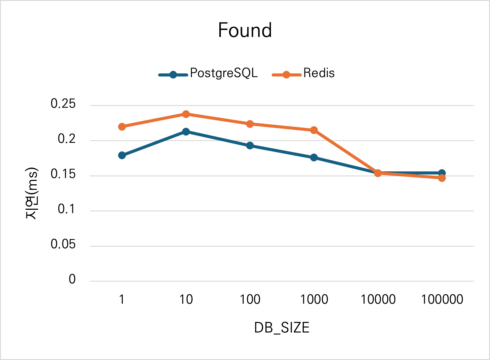
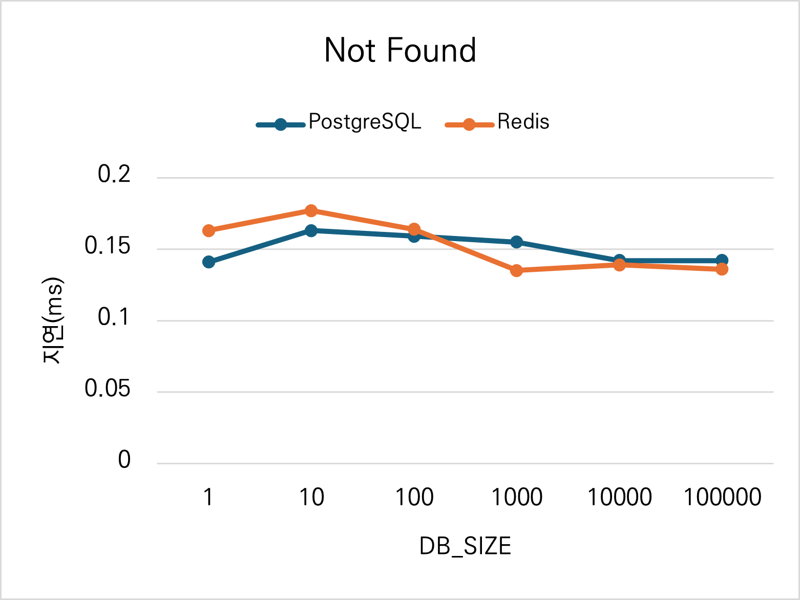
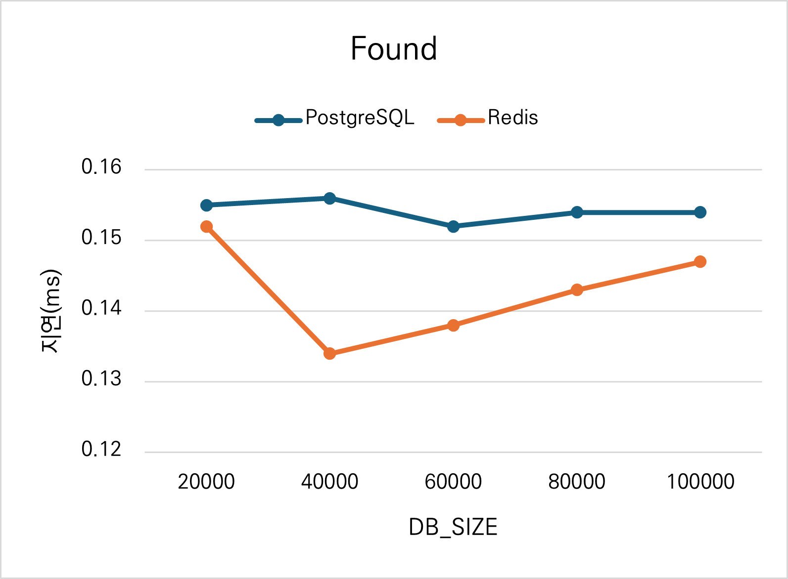
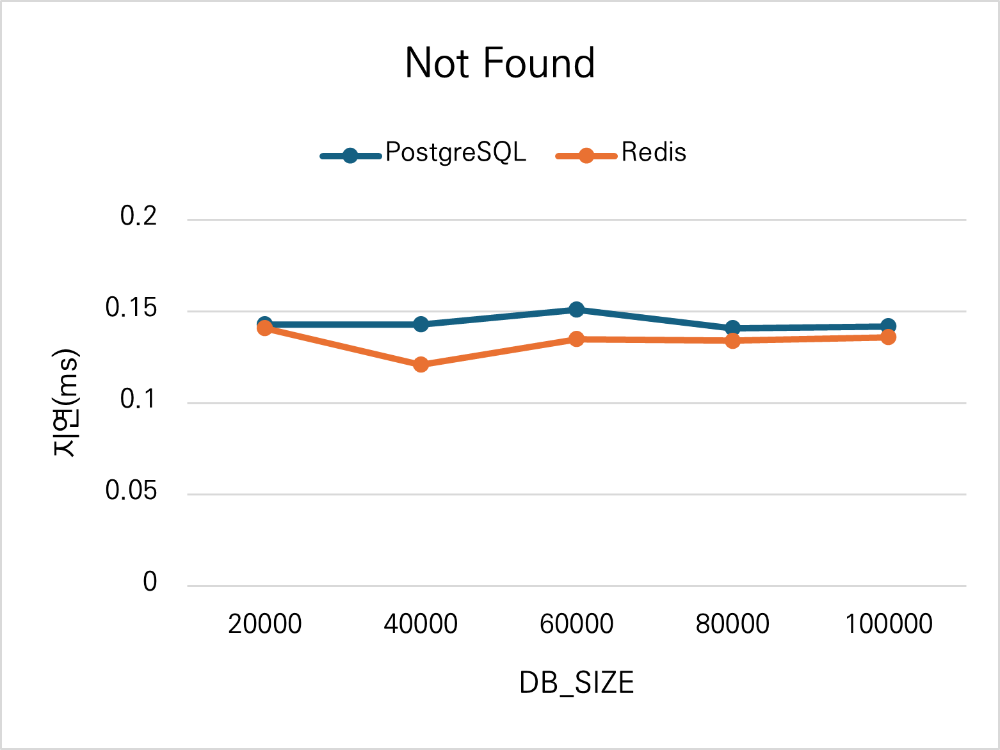

# 피아노베어

| 항목          | 내용 |
|--------------|------|
| 🕒 기간      | 2024-07 ~ 2024-08 |
| 👥 인원      | 6명 |
| 🛠 사용 기술 |        |
| 🎯 담당 역할 | 1) Spring Security와 JWT를 이용한 회원 인증, 인가 기능 개발 (백엔드)<br/>2) 채보(transcriber) 기능 개발 (AI, 백엔드, 프론트엔드) |
| 📖 개요      | 어린이들을 위한 피아노 학습 도우미 웹 서비스 |

# 프로젝트 개요
## 배경 및 목표
많은 아이들이 피아노 학원을 다니며 피아노를 배웁니다. 하지만 흥미 유발이 쉽지 않고 아이들에게 악보를 읽는것은 어렵게 느껴질 수 있습니다.

이를 위해 읽기 쉬운 악보를 만들어주고 다양한 기능들로 피아노 연습을 재미있게 해주는 웹 서비스를 제작하였습니다.


## 주요 기능
### 보기 쉬운 악보 생성
- PDF 형식의 일반 악보를 업로드하면, 계이름을 붙여서 읽기 쉬운 악보로 변환해줍니다.


https://github.com/user-attachments/assets/c7f6722c-82a0-42dc-ac72-4c3a5d1b7bf6

- 악보 업로드 후 AI를 이용해 흥미를 유발할만한 커버 이미지를 생성할 수 있습니다.


https://github.com/user-attachments/assets/9b3995ac-5148-48f2-9034-9111c589acb9

### 음원으로 악보 생성

- 원하는 노래의 음원을 업로드하면 피아노 연주만 추출하여 악보를 생성해줍니다.

https://github.com/user-attachments/assets/36deee6a-8142-4751-a407-cf032f47a560

- 피아노를 제외한 음원을 추출하여 내가 피아노 연주자가 되어 합주를 해볼 수 있습니다.

https://github.com/user-attachments/assets/aeecd583-8af4-4384-ab71-7913f90a1e3e

### 연습, 채점

- 생성된 쉬운 악보를 보며 피아노를 연주할 수 있습니다.

https://github.com/user-attachments/assets/15745ed0-d5ee-4f91-8379-32fadd9fbbd7

- 내 연주를 녹음하여 점수를 측정할 수 있습니다.

https://github.com/user-attachments/assets/c402e797-e1bc-4bb8-81e2-6014b69d83ef

### 놀이터 (화상 연주)
- 화상 채팅을 통해 친구들과 소통하며 재미있게 연주할 수 있습니다.

https://github.com/user-attachments/assets/a06c1915-94e4-4139-a458-4808c2c77785

# 나의 기여
## 1️⃣ Spring Security와 JWT를 이용한 회원 인증 기능
### 상황
클라이언트가 Vue.js 기반의 SPA이기 때문에 토큰을 이용한 회원 기능을 구현하였습니다.

회원 기능은 대부분의 기능에서 광범위하게 사용되기 때문에 동료 백엔드 개발자가 인증이 필요한 부분에서 쉽고 간단하게 인증 정보를 가져올 수 있도록 작성하는것을 목표로 하였습니다.

### Spring Security 설정

```java
// https://github.com/jongwonyang/PianoBear/blob/master/backend/application/src/main/java/kr/pianobear/application/config/SecurityConfig.java

@Configuration
@EnableWebSecurity
@EnableMethodSecurity
@AllArgsConstructor
public class SecurityConfig {
    private final JwtUtil jwtUtil;
    private final CustomUserDetailsService customUserDetailsService;
    private final CustomAuthenticationEntryPoint authenticationEntryPoint;
    private final CustomAccessDeniedHandler accessDeniedHandler;

    private static final String[] AUTH_WHITELIST = {"/api/v1/auth/**"};

    @Bean
    SecurityFilterChain filterChain(HttpSecurity http) throws Exception {
        http.csrf(AbstractHttpConfigurer::disable);
        http.cors(AbstractHttpConfigurer::disable);
        http.sessionManagement(sessionManagement -> sessionManagement.sessionCreationPolicy(SessionCreationPolicy.STATELESS));
        http.formLogin(AbstractHttpConfigurer::disable);
        http.httpBasic(AbstractHttpConfigurer::disable);
        http.addFilterBefore(new JwtAuthFilter(jwtUtil, customUserDetailsService), UsernamePasswordAuthenticationFilter.class);
        http.exceptionHandling(exceptionHandling -> exceptionHandling
                .authenticationEntryPoint(authenticationEntryPoint)
                .accessDeniedHandler(accessDeniedHandler));
        http.authorizeHttpRequests(auth -> auth
                .requestMatchers(AUTH_WHITELIST).permitAll()
                .anyRequest().permitAll());
        return http.build();
    }

    @Bean
    BCryptPasswordEncoder passwordEncoder() {
        return new BCryptPasswordEncoder();
    }
}
```

위 설정에서는 CSRF 및 CORS 보호를 비활성화하고, 세션을 사용하지 않는 `STATELESS` 정책을 적용하였습니다. 또한, `JwtAuthFilter`를 추가하여 모든 요청에서 JWT 검증을 수행합니다.

### JWTUtil 클래스

```java
// https://github.com/jongwonyang/PianoBear/blob/master/backend/application/src/main/java/kr/pianobear/application/util/JwtUtil.java

@Component
public class JwtUtil {
    private final SecretKey secretKey;
    private final long accessTokenExpTime;
    private final long refreshTokenExpTime;
    private final CustomUserDetailsService userDetailsService;

    public JwtUtil(@Value("${jwt.secret}") String secretKey,
                   @Value("${jwt.access-expiration-time}") long accessTokenExpTime,
                   @Value("${jwt.refresh-expiration-time}") long refreshTokenExpTime,
                   CustomUserDetailsService userDetailsService) {
        this.userDetailsService = userDetailsService;
        byte[] keyBytes = Decoders.BASE64.decode(secretKey);
        this.secretKey = Keys.hmacShaKeyFor(keyBytes);
        this.accessTokenExpTime = accessTokenExpTime;
        this.refreshTokenExpTime = refreshTokenExpTime;
    }

    public String createAccessToken(Member member) {
        return createToken(member, accessTokenExpTime);
    }

    private String createToken(Member member, long expireTime) {
        Claims claims = Jwts.claims()
                .add("username", member.getId())
                .add("role", member.getRole())
                .build();

        ZonedDateTime now = ZonedDateTime.now();
        return Jwts.builder()
                .claims(claims)
                .issuedAt(Date.from(now.toInstant()))
                .expiration(Date.from(now.plusSeconds(expireTime).toInstant()))
                .signWith(this.secretKey)
                .compact();
    }

    public String parseUsername(String token) {
        return parseClaims(token).get("username", String.class);
    }

    public boolean validateToken(String token) {
        try {
            Jwts.parser()
                .verifyWith(this.secretKey)
                .build()
                .parseSignedClaims(token);
            return true;
        } catch (JwtException e) {
            return false;
        }
    }
}
```

JWT를 생성하고 검증하는 역할을 수행하는 `JwtUtil` 클래스입니다. `createAccessToken()` 메서드를 통해 JWT를 생성하고, `validateToken()` 메서드에서 토큰이 유효한지 검사합니다.

### JWTAuthFilter 필터

```java
// https://github.com/jongwonyang/PianoBear/blob/master/backend/application/src/main/java/kr/pianobear/application/security/JwtAuthFilter.java

@RequiredArgsConstructor
public class JwtAuthFilter extends OncePerRequestFilter {
    private final JwtUtil jwtUtil;
    private final UserDetailsService customUserDetailsService;

    @Override
    protected void doFilterInternal(HttpServletRequest request,
                                    HttpServletResponse response,
                                    FilterChain filterChain)
            throws ServletException, IOException {
        String authorizationHeader = request.getHeader("Authorization");
        if (authorizationHeader != null && authorizationHeader.startsWith("Bearer ")) {
            String token = authorizationHeader.substring(7);
            if (jwtUtil.validateToken(token)) {
                String username = jwtUtil.parseUsername(token);
                UserDetails userDetails = customUserDetailsService.loadUserByUsername(username);
                SecurityContextHolder.getContext().setAuthentication(
                    new UsernamePasswordAuthenticationToken(userDetails, null, userDetails.getAuthorities()));
            }
        }
        filterChain.doFilter(request, response);
    }
}
```

이 필터는 요청이 들어올 때마다 JWT를 검증하고, 인증된 사용자인 경우 `SecurityContextHolder`에 저장하여 이후 요청에서 사용될 수 있도록 합니다.

### SecurityUtil 클래스

```java
// https://github.com/jongwonyang/PianoBear/blob/master/backend/application/src/main/java/kr/pianobear/application/util/SecurityUtil.java

public class SecurityUtil {
    private SecurityUtil() {}

    public static String getCurrentUserId() {
        Authentication authentication = SecurityContextHolder.getContext().getAuthentication();
        if (authentication != null && authentication.getPrincipal() instanceof UserDetails userDetails) {
            return userDetails.getUsername();
        }
        return null;
    }
}
```

이 유틸리티 클래스는 SecurityContextHolder에서 현재 인증된 사용자의 ID를 쉽게 가져올 수 있도록 도와줍니다.

사용 예시는 다음과 같습니다.

```java
// https://github.com/jongwonyang/PianoBear/blob/master/backend/application/src/main/java/kr/pianobear/application/controller/UserController.java

@GetMapping("/my-info")
@Operation(summary = "내 정보 조회")
@PreAuthorize("hasRole('ROLE_MEMBER')")
public ResponseEntity<MyInfoDTO> myInfo() {
    String currentUserId = SecurityUtil.getCurrentUserId();

    Optional<MyInfoDTO> myInfo = userService.getMyInfo(currentUserId);

    if (myInfo.isEmpty())
        return ResponseEntity.notFound().build();

    return ResponseEntity.ok(myInfo.get());
}
```

### 결과
- 위와 같이 Spring Security와 JWT를 활용하여 회원 인증을 구현하였습니다.
- `JwtAuthFilter`를 통해 JWT를 검증하며, `JwtUtil`을 통해 토큰을 생성 및 관리합니다.
- `SecurityUtil`을 추가하여 인증이 필요한 기능에서 쉽게 현재 사용자 정보를 가져올 수 있도록 구현하였습니다.

## 2️⃣ 회원 기능의 보안 및 성능 문제
### 상황
처음에 로그아웃 기능을 구현할 때, 단순히 클라이언트(브라우저)에서 저장된 토큰을 삭제하는 방식으로 구현했습니다.

그러나 이 방식은 만약 사용자의 토큰이 탈취되어서 로그아웃을 한 경우, 여전히 탈취된 토큰의 사용을 막을 수 없다는 취약점이 있었습니다.

이를 해결하기 위해 다음과 같은 과정으로 개선을 수행했습니다.

### DB에 로그아웃된 토큰을 저장
```java
public void logout(String accessToken, String refreshToken) {
    String accessTokenJti = jwtUtil.parseJti(accessToken);
    String refreshTokenJti = jwtUtil.parseJti(refreshToken);

    int accessExp = jwtUtil.parseExp(accessToken) - jwtUtil.parseIat(accessToken);
    int refreshExp = jwtUtil.parseExp(refreshToken) - jwtUtil.parseIat(refreshToken);

    logoutRepository.save(accessTokenJti, accessExp);
    logoutRepository.save(refreshTokenJti, refreshExp);
}
```

JTI는 JWT의 고유 ID입니다. 로그아웃된 JWT의 JTI를 DB에 저장함으로써 이후 요청마다 해당 토큰이 폐기된 토큰인지 아닌지를 검증할 수 있습니다.

그러나 이 구현에는 2가지 문제점이 있었습니다.

1. 매번 토큰을 인증할 때 마다 DB 접근이 발생한다.
2. 유효기간이 지난 토큰을 DB에서 삭제하는데 추가적인 작업이 발생한다.

2번 문제는 굳이 실시간으로 삭제할 필요는 없었지만 언젠가는 삭제해야 하기 때문에 조금이지만 추가적인 개발이 필요한 상황이었습니다.

1번 문제는 다음과 같이 매번 인증에 쓰이는 `validateToken()`에서 사용되기 때문에 충분히 성능 저하가 있을 것 같았습니다.

```java
public boolean validateToken(String token) {
    try {
        Claims claims = Jwts.parser()
                .verifyWith(this.secretKey)
                .build()
                .parseSignedClaims(token)
                .getPayload();

        String jti = claims.get("jti", String.class);

        if (logoutRepository.expired(jti))
            return false;

        return true;
    } catch (JwtException | IllegalArgumentException e) {
        return false;
    }
}
```

따라서 이를 해결하기 위해 인메모리 DB인 Redis를 도입하였습니다.

### Redis에 로그아웃된 토큰을 저장
```java
// https://github.com/jongwonyang/PianoBear/blob/master/backend/application/src/main/java/kr/pianobear/application/repository/RedisRepository.java

@Repository
public class RedisRepository {

    private final RedisTemplate<String, Object> redisTemplate;

    @Autowired
    public RedisRepository(RedisTemplate<String, Object> redisTemplate) {
        this.redisTemplate = redisTemplate;
    }

    public void save(String key, Object value, long timeout, TimeUnit unit) {
        redisTemplate.opsForValue().set(key, value, timeout, unit);
    }

    public boolean hasKey(String key) {
        return Boolean.TRUE.equals(redisTemplate.hasKey(key));
    }
}
```

Redis는 Key-Value 구조의 인메모리 DB입니다. 따라서 파일시스템을 사용하는 PostgreSQL보다 성능이 좋을것이라 기대하고 도입했습니다.

또한 저장된 정보에 timeout을 설정할 수도 있어 유효기간이 지난 토큰을 폐기하는 것도 자동으로 구현할 수 있었습니다.

Redis 도입은 Spring Data를 통해 구현하였습니다.

이제 로그아웃시 다음과 같이 Redis에 JTI를 저장하고,

```java
// https://github.com/jongwonyang/PianoBear/blob/master/backend/application/src/main/java/kr/pianobear/application/service/AuthService.java

public void logout(String accessToken, String refreshToken) {
    String accessTokenJti = jwtUtil.parseJti(accessToken);
    String refreshTokenJti = jwtUtil.parseJti(refreshToken);

    int accessExp = jwtUtil.parseExp(accessToken) - jwtUtil.parseIat(accessToken);
    int refreshExp = jwtUtil.parseExp(refreshToken) - jwtUtil.parseIat(refreshToken);

    redisRepository.save(accessTokenJti, "logged_out", accessExp, TimeUnit.SECONDS);
    redisRepository.save(refreshTokenJti, "logged_out", refreshExp, TimeUnit.SECONDS);
}
```

토큰 검증시 `RedisRepository`에 요청합니다.

```java
// https://github.com/jongwonyang/PianoBear/blob/master/backend/application/src/main/java/kr/pianobear/application/util/JwtUtil.java

public boolean validateToken(String token) {
    try {
        Claims claims = Jwts.parser()
                .verifyWith(this.secretKey)
                .build()
                .parseSignedClaims(token)
                .getPayload();

        String jti = claims.get("jti", String.class);

        if (redisRepository.hasKey(jti))
            return false;

        return true;
    } catch (JwtException | IllegalArgumentException e) {
        return false;
    }
}
```

### 성능 비교
구현 완료 후, 실제로 PostgreSQL과 Redis를 사용했을 때, 성능 차이가 어느 정도일지 궁금해져서 테스트를 진행했습니다.

PostgreSQL과 Redis에서 각각 SELECT 성능을 비교했으며 10,000회 반복하여 평균을 측정했습니다.

또한 실제 상황에서는 이 토큰이 폐기되었는지 아닌지를 DB에 존재하는지 아닌지로 구분하기 때문에, DB에 존재하는 경우(Found), 존재하지 않는 경우(Not Found)로 나눠서 측정했습니다.

- [PostgreSQL 테스트 코드](https://github.com/jongwonyang/PianoBear/blob/master/backend/application/src/test/java/kr/pianobear/application/performance/PostgreSQLTest.java)
- [Redis 테스트 코드](https://github.com/jongwonyang/PianoBear/blob/master/backend/application/src/test/java/kr/pianobear/application/performance/RedisTest.java)

결과는 다음과 같습니다.

- DB 사이즈: 1 ~ 100,000

| Found | Not Found |
| --- | --- |
|  |  |
| PostgreSQL 대비 Redis 성능 **-10.77%** | PostgreSQL 대비 Redis 성능 **-1.31%** |

- DB 사이즈: 20,000 ~ 100,000

| Found | Not Found |
| --- | --- |
|  |  |
| PostgreSQL 대비 Redis 성능 **+7.98%** | PostgreSQL 대비 Redis 성능 **+7.94%** |

예상과는 달리, 적은 데이터의 양에서는 Redis가 PostgreSQL보다 비슷하거나 조금 더 느린 속도를 보였습니다.

하지만 데이터의 양이 많을 때는 Redis가 PostgreSQL보다 약 8% 정도 빠른 속도를 보였습니다.

이러한 결과가 나온 이유를 다음과 같이 추측하였습니다.

1. PostgreSQL도 메모리에 캐싱을 한다.
2. 따라서 적은 양의 데이터에 대해서는 Redis가 크게 우위를 가지지 못한다.
3. 하지만 데이터의 양의 많아질수록 캐시 miss가 많아지고, 이 때 PostgreSQL은 디스크에 접근해야한다.

### 결과
- 데이터베이스에 폐기된 토큰을 일정기간 저장함으로써 로그아웃에 대한 보안 취약점을 해결하였습니다.
- PostgreSQL 대신 Redis를 사용함으로써 많은 양의 데이터에 대해 약 8%의 성능 향상을 달성했습니다.
- 다만, 적은 양의 데이터에 대해서는 Redis가 비슷하거나 더 느린 속도를 보였습니다.
- 실제 서비스시 적절한 DB를 선택하기 위해서는 운영 경험이 좀 더 필요하다는 것을 느꼈습니다.
